# Deploying your application secrets: Hashicorp Vault and continuous delivery

**2019/03/01**

> This is the english text transcript of the presentation [Déploiement de vos secrets applicatifs : Hashicorp Vault et la livraison en continue](https://cfp.devoxx.fr/2019/talk/LTI-4983/Deploiement_de_vos_secrets_applicatifs_:_Hashicorp_Vault_et_la_livraison_en_continue), made at Devoxx France 2019.

Everybody has secrets: people, machines and web applications. Pretty much any application needs to access external or protected resources: databases, web services, secure tunnels, etc. Today we'll look into securing the resources that gives access to those external systems: **application secrets**.

## Outline

- [Context](#context)
    - [Web application secrets](#web-application-secrets)
    - [Secret in Java file](#secret-in-java-file)
    - [Secret in Tomcat server.xml](#secret-in-tomcat-serverxml)
    - [Today's objective](#todays-objective)
    - [Overview of password workflow](#overview-of-password-workflow)
    - [Prerequisite: Infrastructure as code](#prerequisite-infrastructure-as-code)
    - [Prerequisite: Infrastructure automation](#prerequisite-infrastructure-automation)
    - [Prerequisite: Continuous delivery](#prerequisite-continuous-delivery)
- [Security](#security)
    - [Choosing a tool](#choosing-a-tool)
    - [Buildtime secrets vs Runtime secrets](#buildtime-secrets-vs-runtime-secrets)
    - [Hashicorp Vault](#hashicorp-vault)
    - [Disclaimer](#disclaimer)
    - [Our Vault usage context](#our-vault-usage-context)
    - [Why use Vault decentralized?](#why-use-vault-decentralized)
    - [Team Password Manager](#team-password-manager)
    - [Storage of key -&gt; values](#storage-of-key---values)
    - [Uses permissions and audit logs](#uses-permissions-and-audit-logs)
- [Threat model](#threat-model)
    - [What is a threat model?](#what-is-a-threat-model)
    - [Why a threat model?](#why-a-threat-model)
    - [Threat model: STRIDE](#threat-model-stride)
        - [Threat model: Vault startup](#threat-model-vault-startup)
        - [Threat model: Tomcat startup](#threat-model-tomcat-startup)
    - [Security design implications: decryption key](#security-design-implications-decryption-key)
    - [Security design implications: authentication](#security-design-implications-authentication)
- [In practice](#in-practice)
    - [Overview of delivery pipeline](#overview-of-delivery-pipeline)
    - [Jenkins pipeline (groovy)](#jenkins-pipeline-groovy)
    - [Deploying vault with Ansible](#deploying-vault-with-ansible)
    - [Build infrastructure implications](#build-infrastructure-implications)
    - [Initializing Vault (bash)](#initializing-vault-bash)
    - [Querying Vault at runtime (Java)](#querying-vault-at-runtime-java)
    - [JVM bootstrap vault client](#jvm-bootstrap-vault-client)
    - [Flow diagram of wrap token lease](#flow-diagram-of-wrap-token-lease)
    - [No more secrets in code!](#no-more-secrets-in-code)
    - [Java design implications](#java-design-implications)
- [Operations](#operations)
    - [Performance / Scalability](#performance--scalability)
    - [Monitoring / Alert plan](#monitoring--alert-plan)
    - [Audit](#audit)
    - [Breach detection example](#breach-detection-example)
- [Experience feedback & lessons learned](#experience-feedback--lessons-learned)
    - [Security is hard](#security-is-hard)
    - [Secrets migration](#secrets-migration)
    - [Testing and mocking](#testing-and-mocking)
    - [Build all the things](#build-all-the-things)
    - [Human challenge](#human-challenge)
    - [In retrospective: is it a good specific solution?](#in-retrospective-is-it-a-good-specific-solution)
    - [In retrospective: disadvantages](#in-retrospective-disadvantages)
    - [In retrospective: advantages](#in-retrospective-advantages)
- [Conclusion](#conclusion)
    - [Wrapping up](#wrapping-up)

## Context

### Web application secrets

We define a **secret** as information that can be used to access sensitive data. Pretty much any information that we cannot put on a public repository. That includes:

- Insurer web service credentials (username, password)
- Encryption keys and key passphrases
- Database credentials (username, password)

We do not consider customer credentials and personally identifiable information (PII) to be secrets, since those things are already protected in our database.

### Secret in Java file

Secrets in source code is pretty common, one example being directly in Java files. This examples shows a callback to connect to an external web service that shows cleartext username and password.

```java
public class ClientPasswordCallback implements CallbackHandler {

  private static final String USERNAME = "lesfurets";
  private static final String PASSWORD = "hunter2";

  @Override
  public void handle(Callback[] callbacks) {
    final WSPasswordCallback pc = (WSPasswordCallback) callbacks[0];
    if (USERNAME.equals(pc.getIdentifier())) {
      pc.setPassword(PASSWORD);
    }
  }

}
```

### Secret in Tomcat server.xml

They can also reside in infrastructure code, like this `server.xml` code declaring a new `JDBC` resource for a database connection, also with cleartext username and password.

```bash
&lt;?xml version='1.0' encoding='utf-8'?&gt;
&lt;Server port="1234" shutdown="SHUTDOWN"&gt;
  &lt;!-- ... --&gt;
  &lt;GlobalNamingResources&gt;
    &lt;Resource name="jdbc/b2b2cDatabase" 
                 username="dev"
                 password="hunter2"
                 url="localhost:2345"
                 type="javax.sql.DataSource"
                 driverClassName="org.mariadb.jdbc.Driver"
                 jdbcInterceptors="..."/&gt;
  &lt;/GlobalNamingResources&gt;
  &lt;!-- ... --&gt;
&lt;/Server&gt;
```

### Today's objective

Remove secrets from code and production machines.

We're putting emphasis on this, since your objective might be different, and the solution you'll choose will vary greatly depending on it. You could for instance choose to remove secrets only in code and not on production machines, which is really easier.

### Overview of password workflow

Our objective is to have secret life cycle that works like this:

- A **developer** adds or uses a password key in code (ex: `insurer_password`). He removes the production value if necessary 
- The same **developer** puts a development value in code (ex: `hunter2`). This is useful for accessing a mock service or a test service.
- A **security admin** adds the secret production value in secret management system.
- A **release manager** deploys the application without seeing the production value.
- The production app machine uses the secret

From code to production, different person with different access rights are handling secrets. What is interesting here is that for a small team of developer, all the roles can be filled by the same developer, but as team size grows, the process of enabling different security levels is already in place.

### Prerequisite: Infrastructure as code

Some elements are prerequisite to our Vault and continuous delivery approach. We consider you won't be able to do it without it.

If you do **infratructure as code**, you probably already have secrets in your source code, because your infrastructure configuration requires credentials, like database credentials. We want to keep infra as code, but remove the secrets in the source code.

### Prerequisite: Infrastructure automation

Our machine provisioning and deployment is done with Ansible. It makes **staging possible** by facilitating the creation of new environment and enables **disposable infrastructure** (immutable infrastructure). Basically, it makes losing a machine or a production instance okay because you know you can redeploy it easily.


### Prerequisite: Continuous delivery

At LesFurets we deliver code to production at least daily. Continuous delivery means that it is **easy to push a feature to production** (like a new secret, or changing an existing one fast), and also easy to push an **old version in case of emergency** (or hot fix).

We use Jenkins with the jobs written in pipeline (that's Groovy code), because we can commit the jobs description in our code source.


## Security

### Choosing a tool

Many tools are available for secrets management, yet not all will fit your purpose. Making your own **custom solution** might not be a good idea given how hard it is.

- **Ansible, Chef, etc.** do not remove secrets on production machine, so it was not an option for us, but might be totally reasonable for other use cases
- **Keywhiz** very similar to Vault and could have been a good choice
- **Amazon KMS**, **Azure Key Vault**, **Google KMS** somewhat similar to Vault but tied to specific ecosystem, so it was not an option for us

### Buildtime secrets vs Runtime secrets

You can fetch the secrets at:

- **Buildtime** which means the production machine will have a cleartext copy of the secret, because the build system will replace a secret placeholder (basically the key of the secret) with the secret value before sending the app to production
- **Runtime** which means the production machine will dynamically get the secret, use it, then discard it, resulting in increased security (that's what we want to do)

### Hashicorp Vault

Lightweight, performant, open-source and battle hardened.

- **Seal** and **unseal** makes your Vault safe. It is very useful to zip and send a Vault to another machine, since on startup it means the Vault will not respond to any command until it is unsealed with the **encryption key** generated on Vault initialisation.
- **Wrap** secrets to distribute them safely. It is very useful to provide single use secrets, since a wrapped secret can be unwrapped only once by Vault (subsequent unwraps will fail) and can be restricted with lease and permissions.
- **Authenticate** with different methods. We're using token authentication (wrapped token authentication, enabling a single use, one-time token), but you could also use LDAP authentication, username / password, etc.
- **Audit log** out of the box and easy to use. This is crucial for monitoring and alerting.

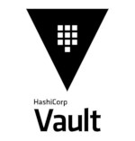

### Disclaimer

This is our field experience feedback, your mileage may vary. We did a very specific design for specific reasons.

### Our Vault usage context

We're deploying **multiple copies** of Vault instead of using it as a **central database**. This is very different from classic usage, but we're doing it for specific reasons.

We can see in the following diagrams that on the left, all environments and JVM instances connects to the same Vault. That can be a problem is the network is bad, if the performance requirements are high, or if the risk of having a single point of failure is too high. We avoid that by deploying one Vault for each JVM instance, which has a lot of advantages for us. You can see the Vault on the right is local to the JVM.

<span class="columns-two">
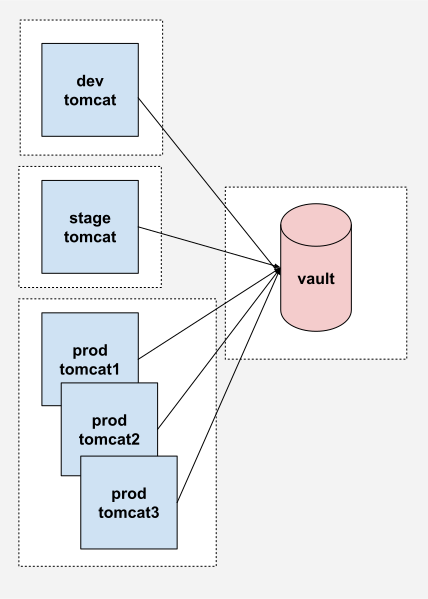

</span>

### Why use Vault decentralized?

We are looking for specific advantages:

- **Disposable infrastructure:** replace instead of modify
- **Continuous delivery:** easier to replace the secrets container
- **Version migration:** don't have to migrate secrets database
- **Attack surface:** infrastructure wide system with all the info
- **Staging:** deploying specific secrets for a specific env
- **SLA:** single point of failure, network issues
- **Performance:** one local Vault per JVM is super-fast

### Team Password Manager

TPM is a password manager (like Vault) containing our secrets, **but it is never used directly by the production servers**.

- **Additional failsafe layer:** if it fails, it doesn't impact the system, and we can repair it at our own pace
- **Easier to migrate:** since the production doesn't depend on it (nobody likes to migrate a live system)
- **Can be any database system:** any *secure* database system (ever another Vault)

### Storage of key -&gt; values

What we need in terms of password manager solution is basically a key -> value storage. The key is the same as the in the code, the value is the secret we're protecting.


### Uses permissions and audit logs

We also need permissions and audit logs for humans and machines as well. That should be necessary and default for any systems handling secrets.

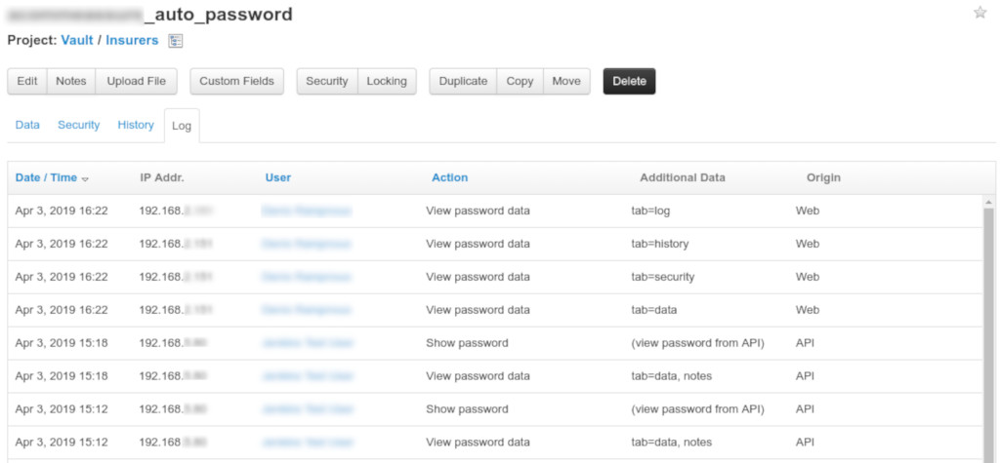

## Threat model

### What is a threat model?

A process by which **potential threats** can be identified, enumerated, and prioritized.

### Why a threat model?

To design a system with **security in mind**.

### Threat model: STRIDE

There are many ways to do a threat model, today we'll use the popular STRIDE method (see [STRIDE (security)](https://en.wikipedia.org/wiki/STRIDE_%28security%29)).

#### Threat model: Vault startup

This is the first of two threat model we'll do, showing the potential threat of creating a Vault and starting it on the production machine.

<span class="fullscreen"></span>

##### Threat model: Vault startup (Denial of service: TPM)

The first potential risk is a **denial of service** threat on TPM (either by malicious intent or bug). This risk is mitigated by two things: it doesn't impact the production Vault (on the left) and can be alleviated by making TPM high availability.

<span class="fullscreen"></span>

##### Vault startup (Information Disclosure: Unseal key)

On the second step the Vault is initialized so the key is kept in memory of the Ansible process. If that key is leaked it could be used to do **information disclosure** since an attacker could unseal the Vault. That risk is mitigated by two things: keeping the key only in memory (with a docker `tmpfs` volume) and making sure the Vault is properly protected by authentication (see next threat model).

<span class="fullscreen">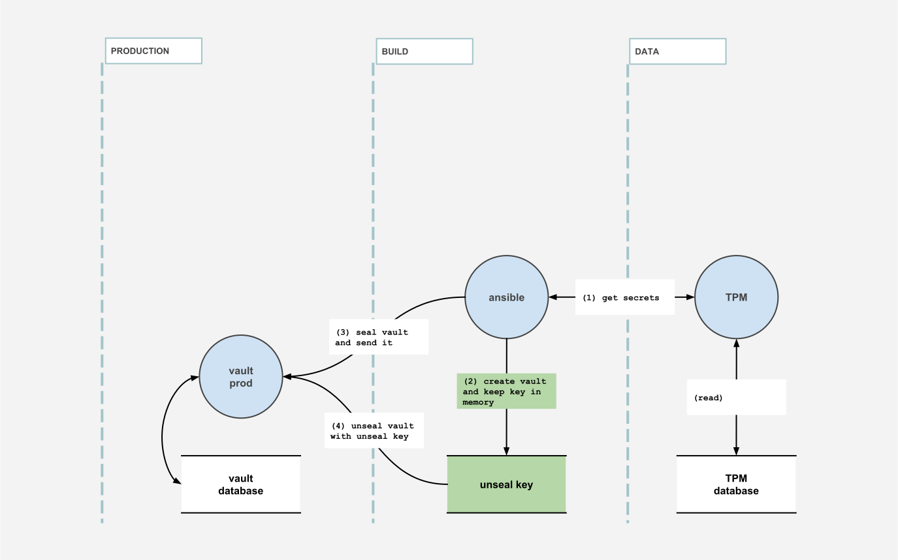</span>

##### Vault startup (Information Disclosure: Unseal key)

On the third step the Vault is sealed then sent to the production machine. There's an **information disclosure** problem if an attacker gets hold of the Vault, but it is mitigated if the key is well protected (see previous and next diagrams). We also assume that Vault's threat model is sound.

<span class="fullscreen">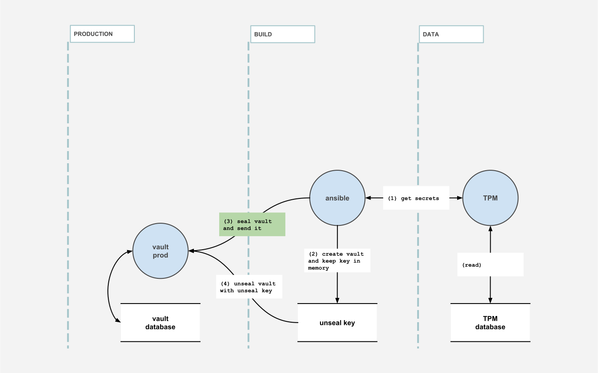</span>

##### Vault startup (Information Disclosure: Key in transit)

On the fourth step the Vault is unsealed by the Ansible process. There's a possible **information disclosure** on the key in transit since it could be intercepted and used to unseal the Vault. The risk is mitigated by passing the key by `stdin` in a SSH tunnel, which is fairly secure.

<span class="fullscreen"></span>

#### Threat model: Tomcat startup

The second threat model is on the bootstrap of the Tomcat that will authenticate on the unsealed Vault (this step is just after the last threat model).

<span class="fullscreen">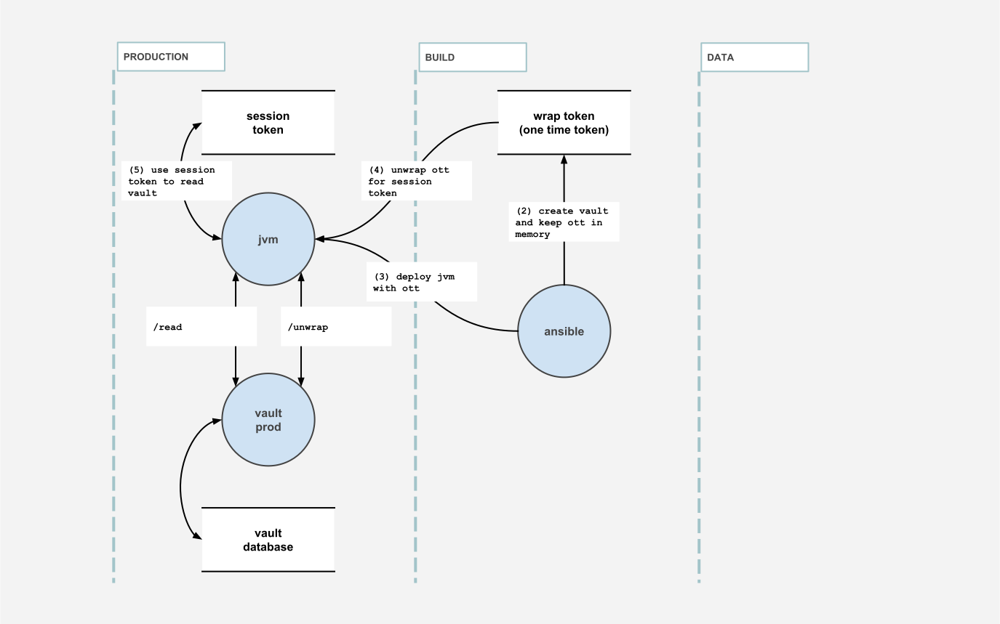</span>

##### Tomcat startup (Elevation of privilege: One time token)

On the second step of the Tomcat startup, the Ansible process will create a single use authentication token that wraps the session token that is authorized to query Vault. If that token is leaked an attacker might be able to **elevate it's privilege** by unwrapping the token and using the session token to query Vault. We're mitigating this attack by: keeping the token in memory only and by unwrapping it soon after on the production machine (validating if it was already unwrapped).

<span class="fullscreen">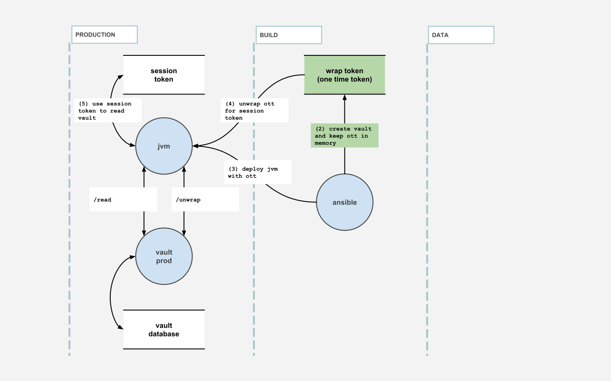</span>

##### Tomcat startup (Elevation of privilege: One time token)

On the third step, we deploy the JVM with the OTT (One Time Token, or single use token). There is a small window here to intercept the content and do a **elevation of privilege** by using the token. We mitigate that risk by making sure the next step happens quickly.

<span class="fullscreen">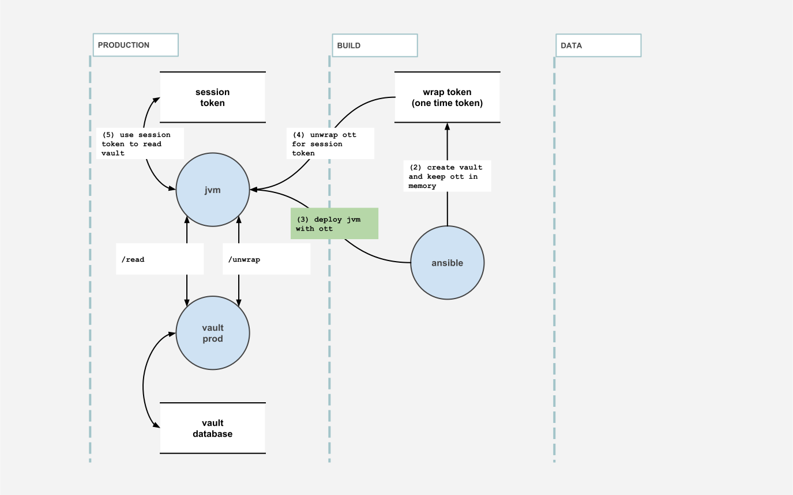</span>

##### Tomcat startup (Denial of service: One time token)

On the fourth step, the JVM will bootstrap itself and unwrap the OTT by calling `unwrap` on the Vault process, giving back the session token. This verifies the token wasn't used by anybody else, but if it was, Vault will throw an exception and should be considered a security breach. The JVM won't start without a connexion to Vault, so that's a **denial of service**, and the security team should close the offending machine, effectively sealing the Vault and stopping the attack.

<span class="fullscreen"></span>

##### Tomcat startup (Spoofing: Session token)

On the last step, the JVM keeps a session token in memory to query (calling `read`) Vault. This session token is stored in memory and if stolen an attacker could **spoof** itself on the Vault. This is mitigated by renewing the token often (with a time to live of 1 minute) and obfuscating the memory (this is harder in Java since memory dumps cannot be prevented).

<span class="fullscreen">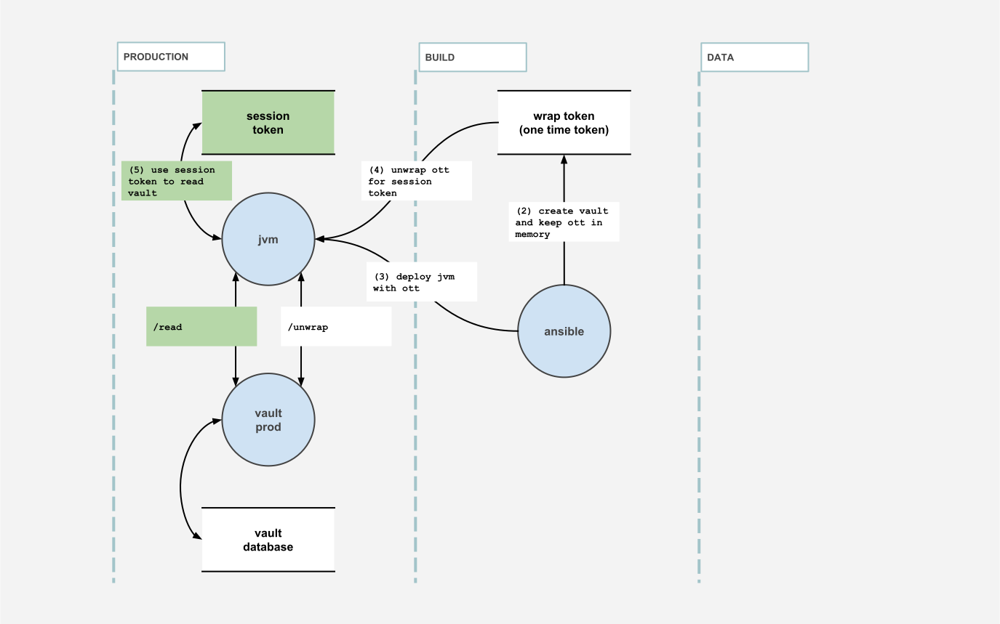</span>

### Security design implications: decryption key

There is only **one decryption key** that can unseal the Vault. It should never be written to disk. If the Vault is sealed (manually or not), it cannot be unsealed again.

If that happens, the application needs to be redeployed.

### Security design implications: authentication

There is only **one, single use, wrapped token** than can provide the **session token**. Once the wrapped token is used, there is no other way of connecting to the Vault.

If the connexion to the Vault is lost for too long, the lease for the session token expires and the app cannot authenticate anymore.

If that happens, the application needs to be redeployed.

## In practice

### Overview of delivery pipeline

This is an overview of the steps necessary to package and deploy Vault and Tomcat on a production server.

<span class="fullscreen">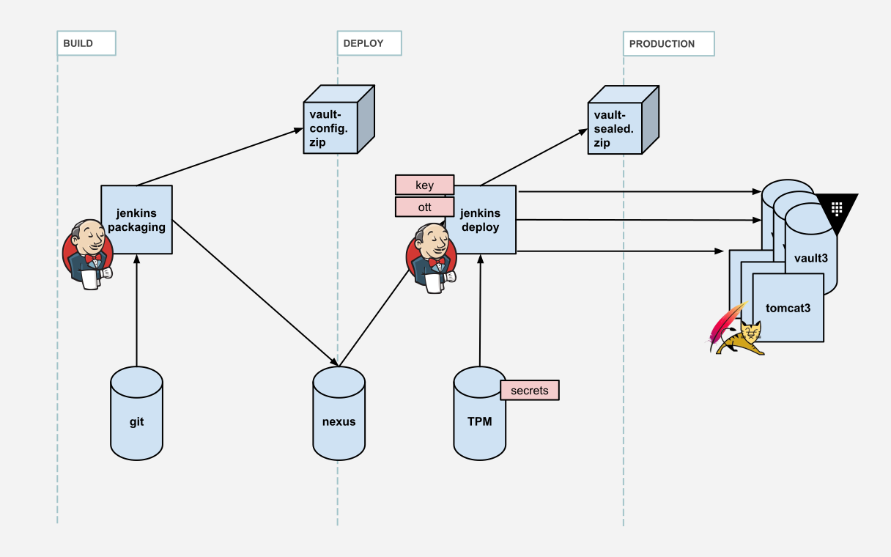</span>

The first step is to get the keys from the source code in git. The keys are generated during build time using annotations.

<span class="fullscreen"></span>

The second step creates an archive with the Vault configuration (policy, server conf, etc.) and the keys.

<span class="fullscreen"></span>

The third step uploads that artefact to Nexus. This is useful because the Jenkins deploy job might not come right after the packaging job.

<span class="fullscreen"></span>

The fourth step gets the Vault artefact from the Nexus.

<span class="fullscreen">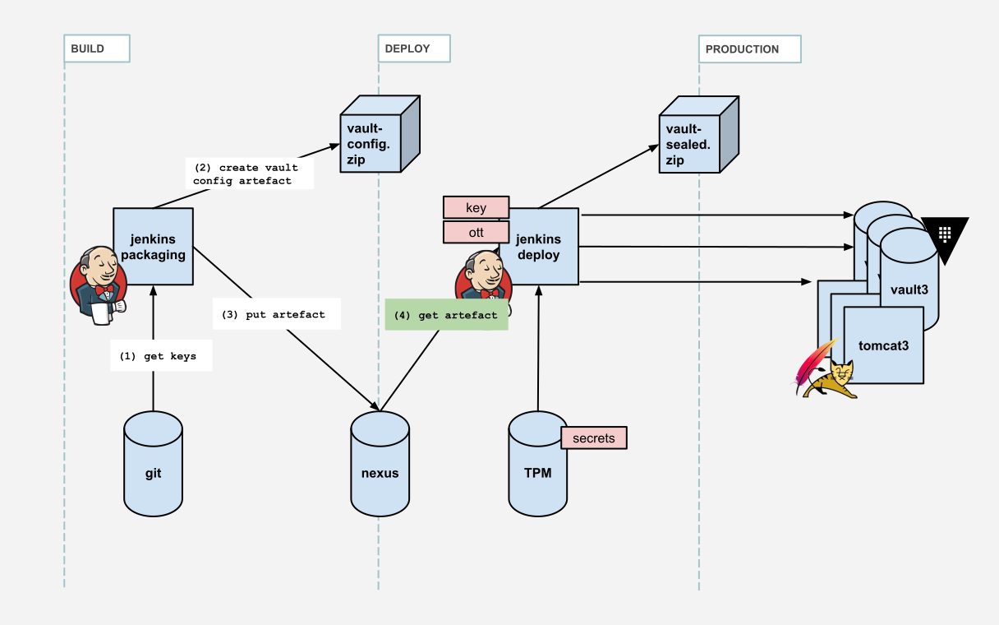</span>

The fifth step will iterate on every key and request the secret value to TPM. It is necessary that this process do not write the secrets to disk, but instead directly to Vault.

<span class="fullscreen"></span>

The sixth step will seal the Vault and zip it to prepare sending it to the production machine. At that point it has both the key and the OTT in memory.

<span class="fullscreen"></span>

The seventh step will copy the zipped Vaults (there is one Vault per Tomcat, so in production we'll package 20 different Vault, each with it's own key, OTT and certificate) to the production machine and start them.

<span class="fullscreen">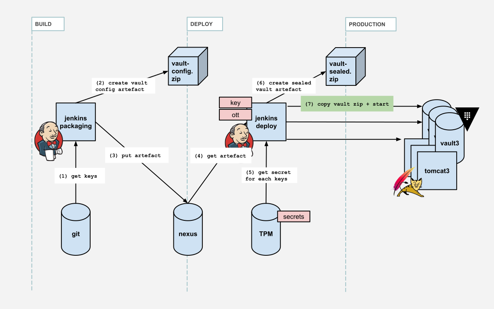</span>

The eight step will unseal the Vaults with the key, the Vaults become usable.

<span class="fullscreen"></span>

The ninth step will start the Tomcat with to OTT, which will make it's bootstrap checks and connect to the Vault.

<span class="fullscreen"></span>

### Jenkins pipeline (groovy)

Because we need to connect to TPM, we need to store the connexion credentials somewhere. We store them in Jenkins Credentials, a secure secrets container that is accessible by the agents. Each environment has its own credentials so we can monitor the jobs and alert if weird behaviors are detected.

The credentials are get using `withCredentials` in the agent process, then passed to the Docker process in environment variable using `withEnv` (this is one of the only safe way of passing secrets between process, also with `stdin`), then used by the Ansible process.

```groovy
dir('scripts/ansible') {
  withCredentials([
        usernamePassword(credentialsId: 'teamPasswordJenkinsUser',
        usernameVariable: 'teamPasswordJenkinsUsername',
        passwordVariable: 'teamPasswordJenkinsPassword')]) {
    withEnv([
        "TEAM_PASSWORD_USERNAME=${teamPasswordJenkinsUsername}",
        "TEAM_PASSWORD_PASSWORD=${teamPasswordJenkinsPassword}"]) {
      sh """
        docker pull ansible/ansible
        docker run -w /playbooks \
                   -e TEAM_PASSWORD_USERNAME \
                   -e TEAM_PASSWORD_PASSWORD \
                   -v \$(pwd):/playbooks \
                   ansible/ansible ansible-playbook ./tomcat-b2c.yml \
                   --inventory=./hosts \
                   --extra-vars='version=${scmHash} target=${conf.nginxEnvName}'
      """
    }
  }
}
```

### Deploying vault with Ansible

Using Ansible is important to have robust deployment automation. It handles network failures, monitors the time taken by each steps and designed in a way that deploying 1000 machines is the same as deploying 1.

```bash
...
[09:31:13] vault - localhost - download from nexus ... | localhost | SUCCESS | 52ms
[09:31:14] vault - localhost - unarchive artifact ... | localhost | CHANGED | 916ms
[09:31:15] vault - localhost - fetch secrets ... | localhost | SUCCESS | 59ms
[09:32:23] vault - localhost - create vault ... | localhost | CHANGED | 5225ms
[09:32:28] vault - localhost - create sealed vault archive ... | localhost | CHANGED | 553ms
[09:32:28] vault - localhost - set vault_key, vault_token ... | localhost | SUCCESS | 120ms
...
```

### Build infrastructure implications

**Jenkins Credentials** storage is used to connect to TPM. Each environment should have it's own monitored credentials.
Handle **secrets in memory only**. Ansible is executed in a **Docker container with <code>tmpfs</code> volumes**, since by default the Docker volumes are written to disk and the key and OTT would leak.
**Deployment time is limited** with a lease of 10 minutes on the wrapped token. Past that time, the application cannot unwrap the token and will not start.

### Initializing Vault (bash)

We're using <code>vault</code> client in Bash to bootstrap the Vault server. Important parts are:

- **Initializing vault** with 1 key to unseal
- **Creating a one-time token** with wrapping and TTL
- **Revoking the root token** and sealing the Vault

```bash
# Start vault with data and log directory (in the background)
nohup vault server -config="conf/install.json" &amp;&gt; logfile &amp;
# (check for startup code omitted)

# Init vault with 1 key, save it and save the root token
STDOUT=$( vault operator init -key-shares=1 -key-threshold=1 -format="json" )
KEY=$( echo "$STDOUT" | jq --raw-output ".unseal_keys_b64[0]" )
TOKEN=$( echo "$STDOUT" | jq --raw-output ".root_token" )

# Unseal vault and authenticate with root token (without ~/.vault-token file)
vault operator unseal "$KEY"
vault login -no-store "$TOKEN"

# setting vault token for next operations
export VAULT_TOKEN="$TOKEN"

# Add read only policy (dev, stage, etc.) for environment to vault
vault policy write "${ENVIRONMENT}" "policies/${ENVIRONMENT}.hcl"

# Mount a new key-value store for the environment (/dev, /stage, etc.)
vault secrets enable -path="${ENVIRONMENT}" kv

# Creates a wrapped token (needs to be unwraped before use), TTL is 10 minutes
vault token create \
-orphan \
-renewable="true" \
-policy="${ENVIRONMENT}" \
-ttl="${TOKEN_TTL}" \
-period="${TOKEN_TTL}" \
-wrap-ttl="${TOKEN_TTL}" \
-format="json" \
| jq --raw-output .wrap_info.token \
&gt; wrap

# Write secrets in vault
# ... (for each key)
value=$( echo "${line}" | cut -d '=' -f 2- | sed 's/^@/\\@/g' )
vault write "${ENVIRONMENT}/${key}" "value=${value}"

# Enable audit log with syslog output (then goes to datadog)
vault audit enable syslog tag="vault-${ENVIRONMENT}-${INSTANCE}"

# Revoke root token, only otp tokens remains
vault token revoke "$TOKEN"

# Seal and close the vault
kill $( cat ${BUILD_DIR}/pid/vault.pid )
```

### Querying Vault at runtime (Java)

Vault server has a **simple REST API** to query data. You can use it directly in Java or use a library like <code>spring-vault</code> (from Spring) or <code>vault-java-driver</code> (from BetterCloud)

### JVM bootstrap vault client

The important part in bootstrapping the connexion between the JVM and Vault is to check the authenticity of the wrapped token. That is done by calling `lookupWrap` on the wrapped token and then by checking the creation path is equal to "auth/token/create". That alone guaranties the token wasn't forged by an attacker (the attacker doesn't have authorization to create tokens on the Vault but it is recommended to test anyway).

You can then proceed call the `unwrap` method with the wrap token, then recreate a second connexion with the session token that will be kept in memory.

```java
LOG.info("Vault using certificate");
SslConfig sslConfig = new SslConfig().pemFile(CERTIFICATE_PATH.toFile())
                                     .build();

LOG.info("Vault response wrapping token validation (wrapToken)");
Vault vault = new Vault(new VaultConfig().sslConfig(sslConfig)
                                               .address(ADDRESS)
                                               .token(wrapToken)
                                               .build());
LogicalResponse lookup = vault.auth().lookupWrap();
String creationPath = lookup.getData().get("creation_path");
if (!"auth/token/create".equals(creationPath)) {
  throw logAndThrow("vault wrong wrapping token path '"
                        + creationPath + "' token might be forged");
}

LOG.info("Vault unwrapping login token");
String sessionToken = vault.auth().unwrap().getAuthClientToken();

LOG.info("Vault starting secure connexion (sessionToken)");
return new Vault(new VaultConfig().sslConfig(sslConfig)
                                        .address(ADDRESS)
                                        .token(sessionToken)
                                        .build());
```

### Flow diagram of wrap token lease

This is an overview of the calls between the JVM and Vault, from JVM bootstrap to reading the information.

The first step is calling `/sys/wrapping/lookup` with the wrapped token, it is described in the previous code snippet.

<span class="fullscreen">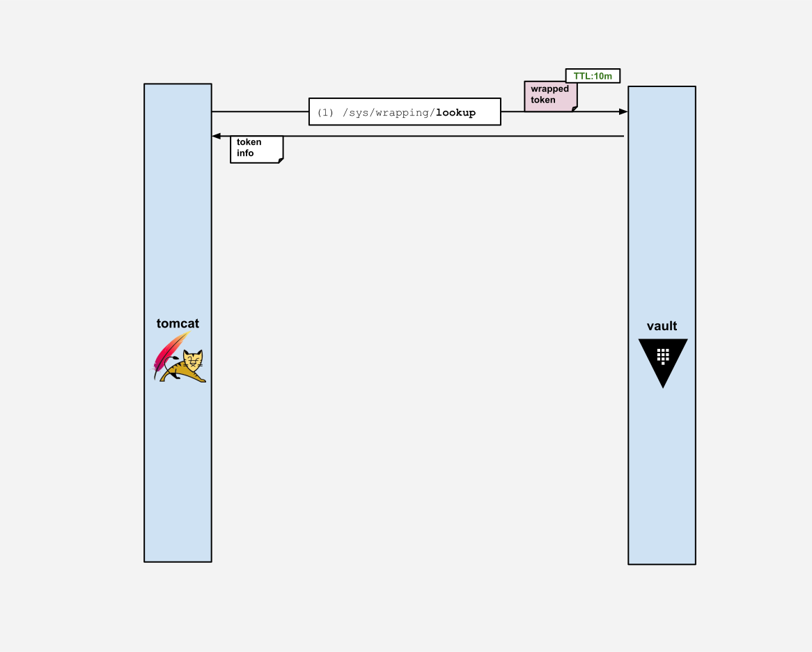</span>

The second step is calling `/sys/wrapping/unwrap` with the wrapped token, which must be done maximum 10 minutes after the creation of the wrapped token (or else the lease will have expired).

<span class="fullscreen">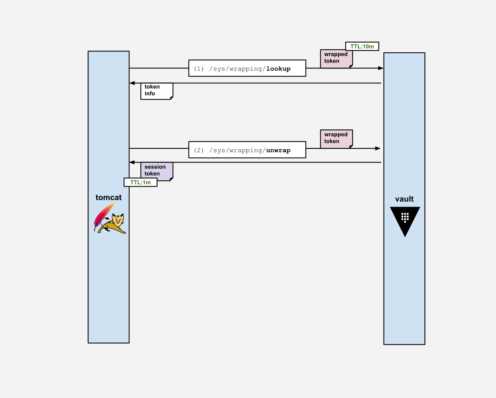</span>

The third step is calling `/auth/token/renew-self` at least once a minute. It is doesn't happen on time, the lease of the session token will expire and the authentication is not possible anymore on the Vault.

<span class="fullscreen"></span>

The fourth step is calling `/v1/prod/mysecret` to get the value of the "mysecret" secret in the "prod" environment. The v1 at the start denotes the secret version, see [Versioned Key/Value Secret Engine](https://learn.hashicorp.com/vault/secrets-management/sm-versioned-kv) for information on how versioned secrets work (we don't use it).

<span class="fullscreen"></span>

### No more secrets in code!

Tada! The first example of this article is free of secrets, goal achieved. Note that we do not assign the secret value to a variable anymore, this is a good practice to reduce secret leakage.

```java
public class ClientPasswordCallback implements CallbackHandler {

  private static final VaultService VAULT = CoreServiceFactory.getInstance().getVaultClient();

  @Override
  public void handle(Callback[] callbacks) {
    final WSPasswordCallback pc = (WSPasswordCallback) callbacks[0];
    if (VAULT.getSecret("insurer_username").equals(pc.getIdentifier())) {
      pc.setPassword(VAULT.getSecret("insurer_password"));
    }
  }

}
```

### Java design implications

Read [OWASP Secure Coding Practices](https://www.owasp.org/index.php/OWASP_Secure_Coding_Practices_-_Quick_Reference_Guide) and make sure it is known in the development team. A secure system needs a secure codebase.

Java isn't a secure language but for our use case using **short lived secrets** (stack memory, not heap memory) is a good start.

Using a security static code analysis tool like Checkmarx is also recommended.

## Operations

### Performance / Scalability


Using Vault decentralized makes it easier to manage and **performance is not an issue** if each JVM has it own Vault. It's also **easier to scale** by adding new Vaults and more **resilient to network failures**

### Monitoring / Alert plan

Along your monitoring, it's very important to **know how to react when you have an alert**. At the very least a list of developers should be notified in case of an error in the secret system.

- **Infrastructure (Datadog)**: monitor CPU usage, memory and process number (each tomcat instance has a Vault instance), this is classic stuff
- **Logs (Datadog)**: alert on any <code>ERROR</code> log from the Vault service (potential security breach), this is very important

### Audit

The audit log is important for two separate reasons: in case of a breach you can **diagnose what happened** and you can **detect a potential breach**.

In an audit log, for each operation on Vault, a new entry is added containing information about the request and the response.

```bash
vault audit enable syslog tag="vault-${ENVIRONMENT}-${INSTANCE}"
```

### Breach detection example

You know what requests (local only) your application does, then you can alert on anything else. Here the "rewew-self" path on the left is quite normal, but no so much on the right with "funky/looking/url" (or the address that should always be localhost).

<p class="columns-two"></p>

```json
{
  "time": "2019-03-19T13:51:46",
    "auth": {
      "client_token": "hmac-sha256:...",
      ...
    },
    "request": {
      "id": "...",
      "operation": "update",
      "client_token": "hmac-sha256:...",
      "path": "auth/token/renew-self",
      "remote_address": "127.0.0.1",
      ...
    },
    "response": {
      ...
    },
}
```
```json
{
  "time": "2019-03-19T13:51:46",
    "auth": {
      "client_token": "hmac-sha256:...",
      ...
    },
    "request": {
      "id": "...",
      "operation": "update",
      "client_token": "hmac-sha256:...",
      "path": "funky/looking/url",
      "remote_address": "123.0.0.0",
      ...
    },
    "response": {
      ...
    },
}
```

## Experience feedback & lessons learned

### Security is hard

The harder you make it for an attacker, the harder it is for you to use your own system.

### Secrets migration

**True Story:** all the insurer that had a "@" in their password crashed when we first deployed to production because of a failed char escape
**When migrating, how do you test?**

### Testing and mocking

Access to the secrets is different now, the most important part is being able to **reproduce the production environment** with proper authorization. You will also need to:

- **Automate migration:** frown upon copy / paste
- **Refactor tests:** to test on the secret key, not the value
- **Mock Vault:** and keep development values in code

### Build all the things

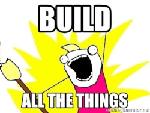

**True Story:** the SSL certificate for the Tomcat to Vault connexion expired.

- **Automate everything:** even certificate renewal, self signed certificates are easy to produce at each deploy for each Tomcat and Vault pair
- **Small jobs:** to redeploy small parts for emergencies

### Human challenge

That's a lot of changes for the development team, you need to make sure that:

- they understand the new process,
- they have the right tools to work,
- they understand the system as a whole.

Experience tells us it's easier to migrate the system part by part, so the teams can adapt progressively.

### In retrospective: is it a good specific solution?

If we remember our goals and advantages, we wanted: disposable infrastructure, continuous delivery, version migration, reduced attack surface, easy staging, good SLA and performance.

### In retrospective: disadvantages

- It is a fairly complex solution compared to classic Vault (but in 6 months in production, no problem in sight)
- Requires really good infrastructure automation and delivery (but we already had that)
- Cannot restart a machine (but redeployment is not a problem if it's fast)

### In retrospective: advantages

- Integrates really well in a continuous deployment and disposable infrastructure environment
- No additional maintenance for the ops team: no new machine to secure and maintain
- No problem when OVH networking fails (spoiler: it fails a lot)
- Easy migrations (spoiler: that's amazing)
- Excellent performance
- Easy staging

## Conclusion

### Wrapping up

Security is hard! But it gets **easier if your solution fits your system and your process**. Make sure you keep your goals and risks in mind when you design your solution and choose your tools.

