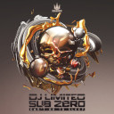
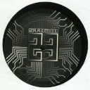
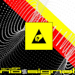

# Top 10 albums of 2018

**2018/12/29**

This year has been rich in discovery of new sounds. From the alien sounding latest Clark EP to downright creepy Herndon's Godmother, it has been a strange year in music production (and also in pretty much everything else).

## List

- idm
    - [Aphex Twin - Collapse EP](#aphex-twin---collapse-ep)
    - [Clark - E.C.S.T. T.R.A.X](#clark---ecst-trax)
- dnb
    - [Sub Zero, DJ Limited - Can't Go to Sleep](#sub-zero-dj-limited---cant-go-to-sleep)
- techno
    - [FABRICLIVE100 - Kode9 & Burial](#fabriclive100---kode9--burial)
    - [Steevio - WSDM008](#steevio---wsdm008)
    - [Quirke - Whities 015](#quirke---whities-015)
- experimental
    - [Autechre - NTS Sessions](#autechre---nts-sessions)
    - [Holly Herndon & JLin - Godmother](#holly-herndon--jlin---godmother)
    - [Topdown Dialectic - Topdown Dialectic](#topdown-dialectic---topdown-dialectic)
- tekno
    - [Keja - Chim'R 06](#keja---chimr-06)
    - [Crystal Distortion - Ixindamix - Studio 23 Reloaded vol 2](#crystal-distortion---ixindamix---studio-23-reloaded-vol-2)
    - [iZi-dSP - No Signal](#izi-dsp---no-signal)

### Aphex Twin - Collapse EP

[Discogs](https://www.discogs.com/Aphex-Twin-Collapse-EP/master/1405505)

I'm so hyped that Aphex Twin came back to the music scene that I'll put anything he does in my favorite list (okay maybe except the awfull [Mt. Fuji](https://www.discogs.com/Aphex-Twin-APHEX-Mt-Fuji-2017/release/10631286)). This album fell bit flat for Aphex fans since it is more of the same sound we know (since the London album), but I still think "T69 Collapse" is one of it's best composition to date (also Weirdcore's [amazing visuals](https://www.youtube.com/watch?v=SqayDnQ2wmw) are amazingly amazing).

### Clark - E.C.S.T. T.R.A.X

[Discogs](https://www.discogs.com/Clark-ECST-TRAX/master/1415170)

Clark might be my favorite artist (outside Aphex) but I was really disappointed by it's last full album [Death Peak](https://www.discogs.com/Clark-Death-Peak/master/1159999). He did release a series of really good singles recently, and I consider this EP to be part of that. The track "Harpsichord" is otherworldly in a way only Clark can compose and really worth the listen.

### Sub Zero, DJ Limited - Can't Go to Sleep

[Discogs](https://www.discogs.com/DJ-Limited-3-Sub-Zero-Cant-Go-To-Sleep/release/12291426)

I listened to that track at a free tekno party (just after a crazy crazy jungle set from [D2s Dnb](https://soundcloud.com/djd2s) go check him out he's amazing) and it just blew my mind. I don't especially listen to dnb in general but this really good (some other resents tracks from DJ Limited like "Turn Up" also sounds like this).

### FABRICLIVE100 - Kode9 & Burial

[Discogs](https://www.discogs.com/Kode9-Burial-Fabriclive-100/master/1444444)

I really like the idea of a produced dj set, in the sense that a set can be reworked and remixed after the act, and even if that's kind of the idea behind fabriclive I feel like this specific release captures this idea. This album isn't all it could have been and falls short in terms of cleanliness, but I fell like the dirty and chaotic part of it makes sense, like if you're really in that rave at track 27 ("Metamesonyxtia Narkogyra"). It jumps from old school disco banger (omg "Black Acid" and "[Polyphonic Raid](../2018-12-29-top-10-mixed-tracks-2018)") to Burial ambient sounds (maybe a bit too much of that noise / vinyl effect all around), to more banger, to uk dnb (like "The Quickening"), and I like that.

### Steevio - WSDM008

[Discogs](https://www.discogs.com/Steevio-WSDM-008/release/12040705)

Steevio could have been Swiss because he produces sound of constant quality and aesthetics. Instead he's British and he makes that most wonderful, wonky, beautiful techno. He's a magnificent modular synthesiser geek (obligatory link to one of his [modular live](https://www.youtube.com/watch?v=CY8lR7Hkjyw)) and that's a huge crush for me.

### Quirke - Whities 015

[Discogs](https://www.discogs.com/Quirke-Whities-015/release/11814868)

That album kind of took by surprise, since "Vatied City" is one of my favorite track of this year even if it sounds brutal and badly recorded. Then comes a wonderful lo-fi track, followed by "Hydraulic Deer", that definitely sounds like 90' Aphex with a twist. Shout out to the UK based [Whities label](https://www.discogs.com/label/652896-Whities?sort=year&sort_order=desc) that basically releases only amazing albums.

### Autechre - NTS Sessions

[Discogs](https://www.discogs.com/Autechre-NTS-Sessions/master/1395770)

There are no words to describe the sound of Autechre. This four part album (well over 5 hours of music) is the culmination of two decades of music production and definitely a must for newcomers and fans alike. Not for the faint hearted, this voyage is well worth your time, between funky beats (looking at you "dummy casual pt.2") and surprisingly melodic tracks for Autechre ("four of seven"), you'll have everything to please your ears.

### Holly Herndon & JLin - Godmother

[Discogs](https://www.discogs.com/Holly-Herndon-Jlin-Godmother/release/12892061)

I kind of melted when I heard this track. Godmother is deeply unsettling. It doesn't sound like anything you've hear before. It really makes me think about modern composition techniques, since the track was partially composed by an AI designed by Holly Herndon and JLin. Those two artists are amazing and I'm really looking forward to hear more.

### Topdown Dialectic - Topdown Dialectic

[Discogs](https://www.discogs.com/Topdown-Dialectic-Topdown-Dialectic/release/12133432)

Topdown dialectic is the perfect example of a well executed soundscape. This self titled album captures the essence of what they do best: ambiance. It might not be surprising, or crazy, or wild, but it is a perfectly well produced voyage. Copyright goes to the stump.

### Keja - Chim'R 06

[Discogs](https://www.mackitekrecords.com/en/shop/product/14920-chimr-06.html)

The extremely prolific Keja (he basically produced a track per month for the past 10 years) returns with yet another album and it sounds... like Keja. This artist has a signature sound so deep you can recognise him a mile around. I really wanted to have Keja in this list since it is by far the artist I've listed to the most in 2018, and even if Chim'R 06 is definitely not one of its best album to date, it is still one of the good mental tekno release of the year. Some of my favorite albums of him are the 3672 series ([3672 16](https://kejamackitek.bandcamp.com/album/3672-13) is a good example) and most of the Mackitek Records series ([MackiTek Records 33](https://kejamackitek.bandcamp.com/album/mackitek-records-33) for example). See also my [most mixed track](../2018-12-29-top-10-mixed-tracks-2018) list what features a lot of Keja.

### Crystal Distortion - Ixindamix - Studio 23 Reloaded vol 2

[Discogs](https://www.discogs.com/Crystal-Distortion-Ixindamix-Studio-23-Reloaded-Vol-2/release/12108343)

Crystal Distortion does [kick ass lives](https://www.youtube.com/watch?v=AYCZY0jusDM). This album, especially the first track "Fucking Ridiculous", captures the essence of its live and that's a first. It also shows an overview of the mythical Spiral Tribe (sp23) crew sound: crazy hardcore tekno banger (Crystal Distortion) and funky ass tribal tekno (Ixindamix). It is not the best release from the sp23 crew but I wanted to have them in this list.

### iZi-dSP - No Signal

[Discogs](https://www.discogs.com/izi-dSP-No-Signal/release/11868281)

The leader of the revered dSP crew is back with another album, and surprisingly, it's not all tekno: there's also a lot of techno. While hoping he hasn't made the switch for the worse like other artist before (looking at you Popof!), this album is just really good (basically like all his album). The first track "Afterhour" is beautiful and melodic (a first), the track "Monster" is a cheezy cheap free tekno party track but I love it (one of my most listened track of 2018), and the rest of the album is really good ambiant tribe (or chill tribe as I like to call it).

