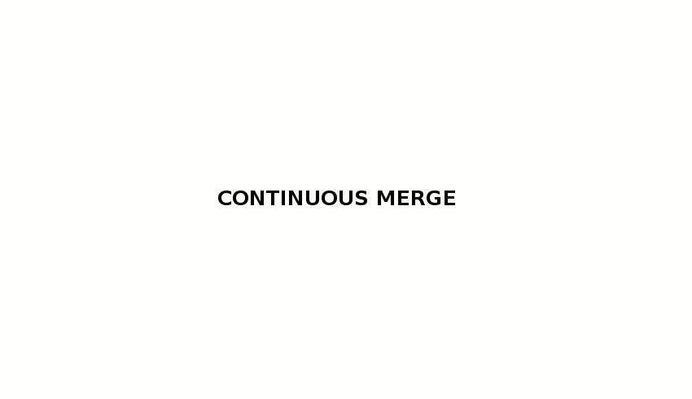

# Continuous merge with git-octopus

<iframe class="star" src="https://ghbtns.com/github-btn.html?user=lesfurets&repo=git-octopus&type=star&count=true" frameborder="0" scrolling="0"></iframe>

## Resources

[Source Code](https://github.com/lesfurets/git-octopus) - [Conferences](https://dubreuia.github.io/alexandredubreuil.com/conferences/continuous-merge-git-octopus)

## Abstract

The continuous merge workflow is meant for continuous integration/delivery and is based on feature branching. git-octopus provides git commands to implement it.

## What is it all about ?

Feature branching and continuous integration don't live well together. The idea of this project is to reconcile those two by using the mighty power of git.

### The branching model

The simpliest form of the model is to have a mainline branch, let's call it <code>master</code>, and feature branches on top of that master. In a continuous delivery workflow you won't need more than that.

### The workflow

git octopus allows you to merge all you feature branches together at any moment so you can have an assembly of all the work that is going on and finally do a continuous integration job on that merge. here's how it works:

