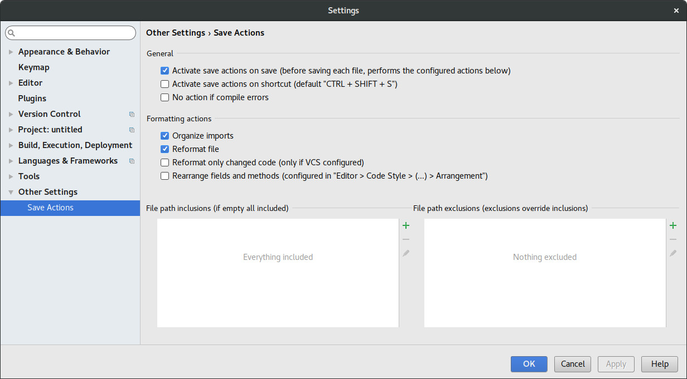
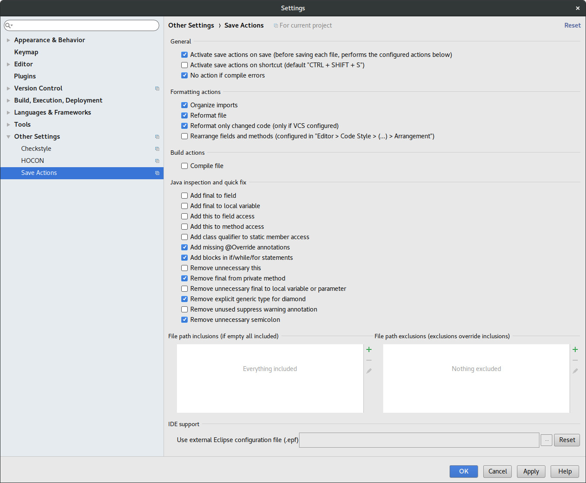

# Save actions plugin for Jetbrains products

<iframe src="https://ghbtns.com/github-btn.html?user=dubreuia&repo=intellij-plugin-save-actions&type=star&count=true" frameborder="0" scrolling="0" width="170px" height="20px"></iframe>

## Resources

[Source Code](https://github.com/dubreuia/intellij-plugin-save-actions)

## Abstract

Supports configurable, Eclipse like, save actions, including "optimize imports", "reformat code", "rearrange code", "compile file" and some quick fixes like "add / remove 'this' qualifier", etc. The plugin executes the configured actions when the file is synchronised (or saved) on disk.

Using the save actions plugin makes your code cleaner and more uniform across your code base by enforcing your code style and code rules every time you save. The settings file (see files location) can be shared in your development team so that every developer has the same configuration.

The code style applied by the save actions plugin is the one configured your settings at "File > Settings > Editor > Code Style". For some languages, custom formatter may also be triggered by the save actions plugin. For example for Dart developers, enable "Use the dartfmt tool when formatting the whole file" option in "File > Settings > Editor > Code Style > Dart > Dartfmt".

