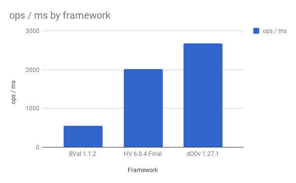
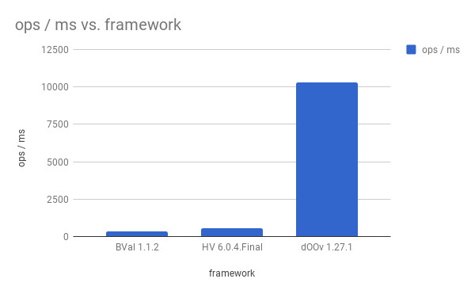

# dOOv revisits Bean Validation benchmark

**2018/01/15**

> The original text was published on [LesFurets Engineering Blog](https://beastie.lesfurets.com/articles/doov-revisits-bean-validation-benchmark) and I talked about it in [multiple conferences](https://alexandredubreuil.com/conferences/domain-object-oriented-validation-doov) and you can check the [project page](https://alexandredubreuil.com/projects/doov).

The dOOv library (Domain Object Oriented Validation) takes a different approach to domain model validation than popular validation libraries. It doesn’t implement the Bean Validation specification, but we thought it would be interesting to compare the performance of the different paradigms.

## Introduction

We’ll be comparing the performance of dOOv, Hibernate Validator (Bean Validation reference implementation) and Apache BVal (another Bean Validation implementation), based on the content and data from this article from 31/10/2017: [Bean Validation benchmark revisited](http://in.relation.to/2017/10/31/bean-validation-benchmark-revisited).

## Contestants

We decided to benchmark 3 implementations:

- [dOOv](https://doov.io) 1.27.1 – released December 14th 2017 (new versions available)
- Hibernate Validator 6.0.4 – released October 25th 2017
- Apache BVal 1.1.2 – release November 3rd 2016

Hibernate Validator is an implementation of Bean Validation 2.0, Apache BVal is an implementation of Bean Validation 1.0, and dOOv is not an implementation of Bean Validation.

## Benchmarks

### Unit benchmarks

We used a subset of the JMH benchmarks from Hibernate Validator. Since dOOv doesn’t implement Bean Validation, we rewrote the benchmark as close as possible to the original benchmark (and noted when it differs).

For this benchmark series, we will run two different benchmarks:

- **SimpleValidation**: we just test a simple bean with a couple of constraints, it is almost identical to the Hibernate Validator benchmark
- **CascadedValidation**: dOOv doesn’t support cascaded validation at the moment, so it is hard to make a comparison. However, we implemented it anyway to outline the different approaches: in dOOv, you have to explicitly reference every field that you want to validate.

### Bean Validation benchmarks

The original article referenced a set of [automated Bean Validation benchmark](https://github.com/gsmet/beanvalidation-benchmark), but we won’t use that since it is too hard to port to dOOv.

## Results

### SimpleValidation JMH benchmark

Out of the box dOOv, is **1.6 times faster** than the latest Hibernate Validation (with 3291 ops/ms). That’s because by default, validation evaluation [short circuit](https://github.com/doov-io/doov/wiki/Validation-Engine#performance-and-evaluation) on first failure.

By deactivating short circuit to follow the Bean Validation standard, dOOv is still **1.3 times faster**, as shown in the following table and graph.

| framework | ops/ms
| --------- | -----
| BVal 1.1.2 | 556
| HV 6.0.4.Final | 2017
| dOOv 1.27.1 | 2675

Numbers are in ops/ms, the higher the better.

### CascadedValidation JMH benchmark

This benchmark is skewed in favor of dOOv, because cascading doesn’t really exists in dOOv. The benchmark was written so that the number of validated instances are the same, and the number of constraints are also the same, so it basically fulfill the same goal.

In dOOv, you explicitly need to list all fields that needs validation. This is a side effect of « flattening » your model, where cycles in the object graph cannot exist. As shown in the following table and graph, dOOv is an order of magnitude faster than the latest Hibernate Validation, around **16 times faster**.

| framework | ops/ms
| --------- | ------
| BVal 1.1.2 | 324
| HV 6.0.4.Final | 577
| dOOv 1.27.1 | 10275

Numbers are in ops/ms, the higher the better.

## Analysis

By choosing a different approach to Bean Validation, dOOv performance is faster that other rule engines. This project is still in it’s infancy, so we didn’t do a lot of performance optimizations, but the results are promising.

While designing dOOv, we learned a couple of lessons:

- **Reflection is slow**, and the solution to that is avoid it by using code generation
- **Lambdas are fast**, not as fast as bare metal Java, but the difference is negligible

## Reproducing these results

These benchmarks were run on a typical engineer laptop (Core i7 with 16 GB of memory). As always, this a micro benchmark, result may differ but you should see the same trends on any computer.

Here is the link to the [benchmark code](https://github.com/doov-io/doov/tree/master/sample/benchmark).

