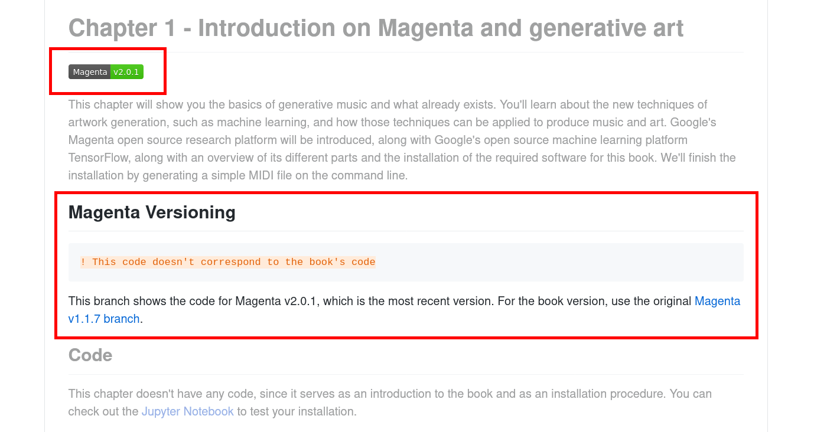

# Music Generation with Magenta 2.0.1: A migration guide from version 1.1.7

**06/06/2020**

 Writing a book about a software library like Google Magenta inhevitably ends by the code evolving while the book slowly becomes obsolete. In my book [Hands-On Music Generation with Magenta](https://www.packtpub.com/data/hands-on-music-generation-with-magenta), we use [Magenta v1.1.7](https://github.com/magenta/magenta/releases/tag/v1.1.7) because at the time of writing, that version was one of the most recent and seemed like the most stable. On June 2rd 2020, the Magenta team has released [Magenta v2.0.1](https://github.com/magenta/magenta/releases/tag/2.0.1), adding support for the Tensorflow 2 package. Writing a second edition of the book, including the changes for that version, would be nice, but as we wait for that, let's look at how we update our code from Magenta 1.1.7 to Magenta 2.0.1.

## Outline

- [Magenta 2.0.1 adds support for the Tensorflow 2 package](#magenta-201-adds-support-for-the-tensorflow-2-package)
- [Managing multiple Magenta versions in Github](#managing-multiple-magenta-versions-in-github)
- [Trying the book’s code with Magenta 2.0.1](#trying-the-books-code-with-magenta-201)
- [Using the Tensorflow migration script](#using-the-tensorflow-migration-script)
    - [Migrating the entry points, flags, logging, and IO](#migrating-the-entry-points-flags-logging-and-io)
    - [Migrating the model save](#migrating-the-model-save)
    - [Migrating the contrib module for hyperparameters](#migrating-the-contrib-module-for-hyperparameters)
    - [Choosing an import style](#choosing-an-import-style)
- [Migrating to Magenta 2.0.1](#migrating-to-magenta-201)
    - [Migrating the RNN models](#migrating-the-rnn-models)
    - [Migrating the GANSynth model](#migrating-the-gansynth-model)
- [Testing all the things](#testing-all-the-things)
- [Looking forward for Magenta](#looking-forward-for-magenta)

## Magenta 2.0.1 adds support for the Tensorflow 2 package

The Tensorflow 2 package support is the biggest change for Magenta 2.0.1. It has been discussed for a while (see the topic on [Magenta Discuss](https://groups.google.com/a/tensorflow.org/forum/#!topic/magenta-discuss/-3EQsDlbHio)) and is useful for people using Magenta in a project that requires Tensorflow 2, or for people that requires a Python version after 3.6 (Tensorflow 1 will not be supporting anything newer).

Magenta 2.0.1 doesn't use the new Tensorflow 2 API, but it supports the package using the `tensorflow.compat.v1` module. See the Github issue [Update Magenta to support TF2 - #1594](https://github.com/magenta/magenta/issues/1594) for more information.

## Managing multiple Magenta versions in Github

We didn't want to modify the [Music Generation using Magenta book's code](https://github.com/PacktPublishing/hands-on-music-generation-with-magenta) in Github since we though that it might confuse the readers if the code presented in the book doesn't correspond to the code on Github. Instead, we created a new branch, [magenta-v2.0.1](https://github.com/PacktPublishing/hands-on-music-generation-with-magenta/tree/magenta-v2.0.1) which contains the updated code for Magenta 2.0.1.



You can see what Magenta version you should be using by looking at the badge at the top of the README and in the Python files.

- [**Magenta v1.1.7** (in the `master` branch)](https://github.com/PacktPublishing/hands-on-music-generation-with-magenta) - The book's code uses Magenta 1.1.7 which, at the time of publication, was the latest stable available version. The code for that version is in the default `master` branch and will stay there.
- [**Magenta v2.0.1** (in the `magenta-v2.0.1` branch)](https://github.com/PacktPublishing/hands-on-music-generation-with-magenta/tree/magenta-v2.0.1) - We also provide the code for newer versions of Magenta, like Magenta 2.0.1 which is latest version we have the code for.

## Trying the book's code with Magenta 2.0.1

Let's first install Magenta version 2.0.1, by following the installation instructions in the book. We've created a new branch to use Magenta 2.0.1 and you can find the installation instructions in [Chapter 01](https://github.com/PacktPublishing/hands-on-music-generation-with-magenta/tree/magenta-v2.0.1/Chapter01).

You should create a new Python environment. Using Conda:

```bash
conda create --name magenta-2.0.1 python=3.6
conda activate magenta-2.0.1
```

Then install the new version of Magenta and the book's dependencies:

```bash
pip install magenta==2.0.1 visual_midi tables
```

Now we can start running the book's examples, let's try the first one, `chapter_02_example_01.py`:

```bash
python chapter_02_example_01.py
```

Resulting in:

```
Traceback (most recent call last):
  File "/home/alex/Projects/hands-on-music-generation-with-magenta/Chapter02/chapter_02_example_01.py", line 112, in <module>
    tf.app.run(generate)
AttributeError: module 'tensorflow' has no attribute 'app'
```

This means we first have to migrate the book's code to Tensorflow 2.

## Using the Tensorflow migration script

Reading the [Tensforflow migration guide](https://www.tensorflow.org/guide/migrate) is helpful. We'll start by using the [Tensorflow upgrade script](https://www.tensorflow.org/guide/upgrade):

```bash
for file in $( find . -name 'chapter_*.py' | sort )
do
    # The tf_upgrade_v2 script is located
    # in $MINICONDA_HOME/envs/magenta-2.0.1/bin
    tf_upgrade_v2 --infile ${file} \
                  --outfile ${file}.tf2.py
    cat report.txt >> report-all.txt
done
```

This will create a bunch of new Python files suffixed with `.tf2.py` that we can compare to the old ones. Let's look at the script's report for the error, warning and info messages using:

```bash
cat report-all.txt | grep ERROR
cat report-all.txt | grep WARNING
cat report-all.txt | grep INFO
```

The messages lists the modifications made by the migration script, which we'll be looking at one by one.

### Migrating the entry points, flags, logging, and IO

When checking in the migration script report for the `INFO` severity, we get:

```bash
INFO: Renamed 'tf.app.run' to 'tf.compat.v1.app.run'
INFO: Renamed 'tf.logging.set_verbosity' to 'tf.compat.v1.logging.set_verbosity'
INFO: Renamed 'tf.app.flags' to 'tf.compat.v1.app.flags'
INFO: Renamed 'tf.gfile.MakeDirs' to 'tf.io.gfile.makedirs'
```

This means the migration script successfully migrated the entry point with `tf.compat.v1.app.run`, the logging with `tf.compat.v1.logging`, the flags with `tf.compat.v1.app.flags`, and for the IO with `tf.io`. There's nothing else to do here.

### Migrating the model save

When checking for warning, we get:

```bash
WARNING: *.save requires manual check. (This warning is only applicable if the code saves a tf.Keras model) Keras model.save now saves to the Tensorflow SavedModel format by default, instead of HDF5. To continue saving to HDF5, add the argument save_format='h5' to the save() function.
```

Fortunately, there's nothing to do here, since we aren't saving a `tf.Keras` model.

### Migrating the contrib module for hyperparameters

When checking for errors, we get:

```bash
ERROR: Using member tf.contrib.training.HParams in deprecated module tf.contrib. tf.contrib.training.HParams cannot be converted automatically. tf.contrib will not be distributed with TensorFlow 2.0, please consider an alternative in non-contrib TensorFlow, a community-maintained repository such as tensorflow/addons, or fork the required code.
```

Unfortuately in Tensorflow 2, the `contrib` module is gone, so we have to add a dependency to the contribution module we want. This is already done for the `HParams` class since it is used in Magenta. We import the `contrib_training` module (which in turn imports `from tensor2tensor.utils.hparam import HParams`) to have access to the class:

```python
from magenta.contrib import training as contrib_training
```

Which makes `contrib_training.HParams` available.

### Choosing an import style

When importing Tensorflow, we can import it using `import tensorflow as tf` and then write `tf.compat.v1` everywhere we use it, or import Tensorflow using `import tensorflow.compat.v1 as tf`. We choose the former, which is more verbose, since it shows at every call that we are using the Tensorflow 1 compatibility mode, making it clearer we are not really using the new Tensorflow 2 API. In Magenta's code, the other approach is used.

## Migrating to Magenta 2.0.1

Now that we modified our code to use Tensorflow 2, we'll make some modification regarding Magenta.

### Migrating the RNN models

We can try our first example again:

```bash
python chapter_02_example_01.py
```

Resulting in:

```bash
Traceback (most recent call last):
  File "/home/alex/Projects/hands-on-music-generation-with-magenta/Chapter02/chapter_02_example_01.py.tf2.py", line 112, in <module>
    tf.compat.v1.app.run(generate)
  File "/home/alex/Programs/miniconda3/envs/magenta/lib/python3.6/site-packages/tensorflow/python/platform/app.py", line 40, in run
    _run(main=main, argv=argv, flags_parser=_parse_flags_tolerate_undef)
  File "/home/alex/Programs/miniconda3/envs/magenta/lib/python3.6/site-packages/absl/app.py", line 299, in run
    _run_main(main, args)
  File "/home/alex/Programs/miniconda3/envs/magenta/lib/python3.6/site-packages/absl/app.py", line 250, in _run_main
    sys.exit(main(argv))
  File "/home/alex/Projects/hands-on-music-generation-with-magenta/Chapter02/chapter_02_example_01.py.tf2.py", line 21, in generate
    bundle = mm.sequence_generator_bundle.read_bundle_file(
AttributeError: module 'magenta.music' has no attribute 'sequence_generator_bundle'
```

This can be fixed by using the `magenta.models.shared` module instead of `magenta.music` for the sequence generator bundle. This change needs to be made for any RNN model (bundle based).

### Migrating the GANSynth model

When launching the GANSynth model:

```bash
python chapter_05_example_02.py.tf2.py
```

We get another error:

```
...
2020-06-06 10:51:52.941362: W tensorflow/core/framework/op_kernel.cc:1753] OP_REQUIRES failed at matching_files_op.cc:49 : Not found: /tmp/gansynth; No such file or directory
Traceback (most recent call last):
  File "/home/alex/Projects/hands-on-music-generation-with-magenta/Chapter05/chapter_05_example_02.py.tf2.py", line 144, in <module>
    tf.compat.v1.app.run(app)
  File "/home/alex/Programs/miniconda3/envs/magenta/lib/python3.6/site-packages/tensorflow/python/platform/app.py", line 40, in run
    _run(main=main, argv=argv, flags_parser=_parse_flags_tolerate_undef)
  File "/home/alex/Programs/miniconda3/envs/magenta/lib/python3.6/site-packages/absl/app.py", line 299, in run
    _run_main(main, args)
  File "/home/alex/Programs/miniconda3/envs/magenta/lib/python3.6/site-packages/absl/app.py", line 250, in _run_main
    sys.exit(main(argv))
  File "/home/alex/Projects/hands-on-music-generation-with-magenta/Chapter05/chapter_05_example_02.py.tf2.py", line 136, in app
    audio_clip = generate_audio(notes)
  File "/home/alex/Projects/hands-on-music-generation-with-magenta/Chapter05/chapter_05_example_02.py.tf2.py", line 87, in generate_audio
    model = lib_model.Model.load_from_path(checkpoint_dir, flags)
...
  File "/home/alex/Programs/miniconda3/envs/magenta/lib/python3.6/site-packages/tensorflow/python/framework/ops.py", line 6653, in raise_from_not_ok_status
    six.raise_from(core._status_to_exception(e.code, message), None)
  File "<string>", line 3, in raise_from
tensorflow.python.framework.errors_impl.NotFoundError: /tmp/gansynth; No such file or directory [Op:MatchingFiles]

Process finished with exit code 1
```

This one was harder to fix. Since we now are using Tensorflow 2, the behavior has changed, which didn't impact the previous models, but impacts this one. When loading the GANSynth model using `lib_model.Model.load_from_path(checkpoint_dir, flags)`, Tensorflow 2 will think we are training the model and will try to load a dataset. To revert that behavior to the old one, we need to use `tf.compat.v1.disable_v2_behavior()` when our script begins. We added that to all the scripts, but it seems necessary for the GANSynth model only.

## Testing all the things

We've tested every script from the book with Magenta 2.0.1 and they all work as expected. Please let us know if you have any issue with the new branch.

## Looking forward for Magenta

The Magenta team is focusing on the newer models (DDSP, etc.), which means that the old ones (RNNs, VAEs, GANSynth, etc.) are still maintained, but not getting new content. This migration to Tensorflow 2 for **ALL** the models is a really nice update 😀.

A changing trend for Magenta is that the new models will likely each have their own repository, making it easier to upgrade to newer versions for some models but not others. For example, the latest model, [DDSP](https://github.com/magenta/ddsp), sits in its own repository on Github.

We'll be covering DDSP in a later publication.

