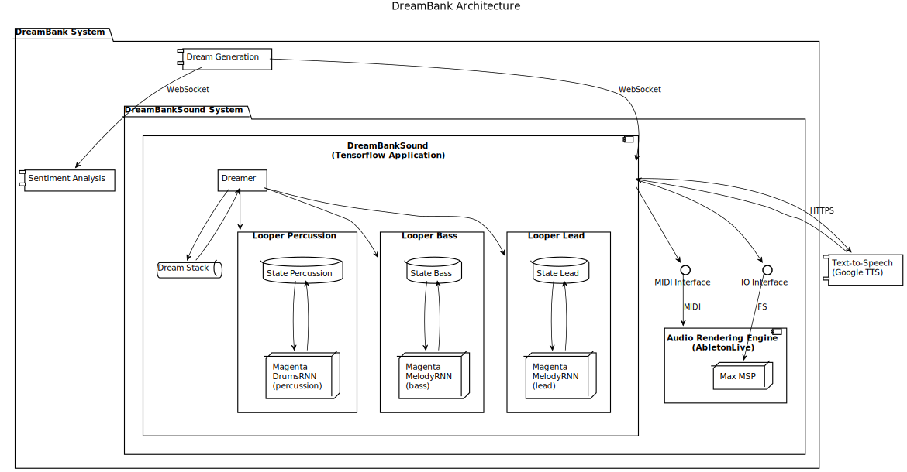
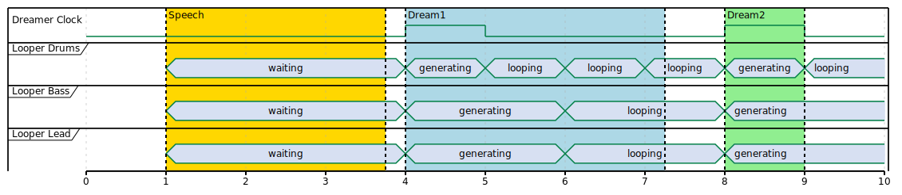

# Dreambank: a Generative Music System Based on Magenta

**08/12/2020**

[Dreambank](http://claire-malrieux.com/DreamBank) is a contemporary art piece by Claire Malrieux, exploring the idea of the dream of a machine. In this artwork, the machine wanders in generated dreams of image, text, voice, and music. Here is a video extract of DreamBank:

TODO embed [DreamBank](https://vimeo.com/384621384)

The music is generated by a live system based on Google's Magenta. This article gives an overview of how the DreamBankSound system works. Here are some high-quality recordings of the audio generated by the system:

TODO embed soundcloud

## Outline

- overview
    - this only details the music part, not the visual part
    - diagram of the system
    - components
        - dream generation component (todo network)
        - (protocols: web socket)
        - speech generation component (gcp)
        - (protocols: web socket)
        - sentiment analysis component (todo network)
        - (protocols: web socket)
        - generative music component (magenta rnns)
            - rythmic
            - bass
            - lead
        - (protocols: midi / max msp)
        - audio rendering engine
- generative music component deep dive
    - based on book
    - based on conference
    - networks 3 rnns that work together
    - network generation changes on emotion
        - primer
        - temperature
        - loop size
    - safeguards and resets
    - speech
- audio rendering engine
    - ableton live
    - communicates using midi for notes
    - communicates using midi for instrument select
    - optimizing for multiprocessors: vertical tracks and dummies
    - uses max msp for speech wav load

## Overview

At a high-level view, the DreamBankSound system receives as an input the text of a dream (from a WebSocket), and outputs MIDI and WAV files to an audio rendering engine. We won't be looking at the parts that are prior to receiving the dream's content (dream generation, sentiment analysis, etc.) or the video generation (drawing generation, video rendering, etc.), first because those subjects would require their own posts, and second because I didn't write those parts, my excellent collegue [Le Phasme](https://github.com/LePhasme/) did.

Let's have a look at a simplified overview of the DreamBank Architecture:

The part that we'll be looking at is "DreambankBankSound System" folder, which contains all the required parts for making the audio generation work. We'll be looking at those elements in detail, but before let's have a look at what the "DreamBankSound" component receives as its input.

## Receiving Dreams of Joy and Apocalypse

When the DreamBankSound component receives a dream via the WebSocket connection, it also receives a sentiment analysis of the dream's text. The dream's text looks like this: "TODO", and each part of the dream has an attached sentiment: "joy", "sadness", etc. From that information, the sound component will do 3 things:

1. Generate speech from the dream's text (external system)
2. Generate MIDI tracks corresponding to the sentiments
3. Send the generated speech and MIDI tracks to an audio rendering engine

We won't be talking about the first element, since the generated speech comes from an external system (Google Text-to-Speech). Let's look at how the system generates the MIDI tracks.

## Generating Music from a Dream

 Now let's delve deeper into the DreamBankSound component, which is a Python Tensorflow application. This component is based on my previous works, namely my "Hands-On Music Generation with Magenta" and also this conference which uses the same technique as described here:

<iframe class="video" src="https://www.youtube-nocookie.com/embed/O4uBa0KMeNY" frameborder="0" allow="accelerometer; autoplay; encrypted-media; gyroscope; picture-in-picture" allowfullscreen></iframe>

First, there is a thread that keeps the time and state information updated, which I call the `Dreamer`. The `Dreamer` receives the dream information, splits it up into different parts and pushes them into multiple queues that represent the next state change for the RNN networks that generates sequences continuously.

The state change for each instrument is an important part of this system so we'll have a look into that first.

### Dreaming Like a Metronome

We can see the `Dreamer` thread like a metronome, which keeps a stack of dreams to generate sound for in the "Dream Stack" and which sends updates to the loopers for percussion, bass, and lead. This component is important for keeping the loopers in sync, but more importantly to make them play **in unison**. As you might know, each RNN will generate separate sequences, but nothing really binds them together. This is what the `Dreamer` does!

For example, if we currently are dreaming about something joyful, the `Dreamer` might update the percussion to a fun drum pattern, the bass and lead to major chords (the RNNs are monophonic though, more on that later). If we are dreaming about something intense, maybe we want start the beat with a fast four on floor rhythm. We are using a `Looper` thread to keep the state of each instrument and to encapsulate the generation rules.

Each `Looper` thread uses an RNN that corresponds to its instrument. In Magenta, the RNNs can be "primed", meaning we can initialize the network with a starting sequence. The `Dreamer` uses that to prime the 3 networks in unison (same key, same rhythm).

Basically, when we start a new dream, we use a priming sequence (TODO link to code):

    sequence = sequence_generator.generate(priming_sequence, generator_options)

Then each `Looper` thread will keep its sequence, looping it for a while (TODO link to code):

    sequence = ss.trim_note_sequence(sequence, loop_start_time, loop_end_time)
    sequence = ss.shift_sequence_times(sequence, seconds_per_loop)

Sometimes the `Looper` decides to generate a new sequence, based on the previous one (TODO link to code):

    sequence = sequence_generator.generate(sequence, generator_options)
    sequence = ss.trim_note_sequence(sequence, generation_start_time, generation_end_time)

This process is used is for a single dream, let's see what happens when we change a dream.

### Wandering in Dreams

The `Dreamer` keeps track of the dream stack and the timing regarding the dream changes. When a dream changes, we want to regenerate the sequences, which basically resets the states of the `Looper`. Here is a timing diagram showing the dream change:

In the diagram, each tick is a bar. Because the speech and dream start and end can occur outside of the musical timing, the dreamer will synchronize the loopers on the bar start and end. Also, each looper can generate sequences of varying lengths, but should always play at the same QPM. Let's now have a look at how to play (send) the sequence.  

### Sending the sequences for playback

Now that the sequences are generated, they are sent to an audio rendering engine (we're using Ableton Live), basically any software that can turn MIDI notes into sound. To send the notes, we are using the `midi_hub` package from Magenta, from which we initialize a `player`:

    player = self._midi_hub.start_playback(sequence, allow_updates=True)
    player._channel = self._midi_channel

Notice how we change the player channel, this is because we are sending 3 MIDI tracks to the audio engine for playback. Then for each generated sequence, we need to update the time to the wall clock (absolute time) and update the player:

    sequence_adjusted = music_pb2.NoteSequence()
    sequence_adjusted.CopyFrom(sequence)
    sequence_adjusted = adjust_sequence_times(sequence_adjusted,
                                            wall_start_time - diff_time)
    player.update_sequence(sequence_adjusted, start_time=expected_start_time)

The player will update the sequence and send the MIDI notes (on/off, note, velocity, etc.) with proper timing on the given MIDI channel.

### Guarding Against Nightmares

Since the generations can last pretty long for a single dream, we need safeguards against "drifting" generations. The RNNs can generate quite a wide range of sequences and we want to make sure they don't wreck havoc on our music. This can be done by analysing the output of the generated sequences and verify some predetermined threshold:

    # Number of total notes need to be under a max threshold
    pitch_list = []
    for note in sequence.notes:
        pitch_list.append(note.pitch)
    pitch_counter = Counter(pitch_list).most_common()
    if len(pitch_list) > self._max_num_notes:
        tf.logging.warn("Too many total notes, reset")
        sequence = music_pb2.NoteSequence()
        sequence = loop(sequence, loop_start_time, loop_end_time, seconds_per_loop)

There are a lot of interesting threshold to implement:

- If there isn't enough notes, generate until there's enough (or reset if there's too much)
- If the same note appears a lot, there might be a problem with the generation (see `pitch_counter` in previous code)
- Detect certain structure (e.g. too many kicks in a calm track won't work)

TODO closing

## TODO audio rendering engine

TODO
