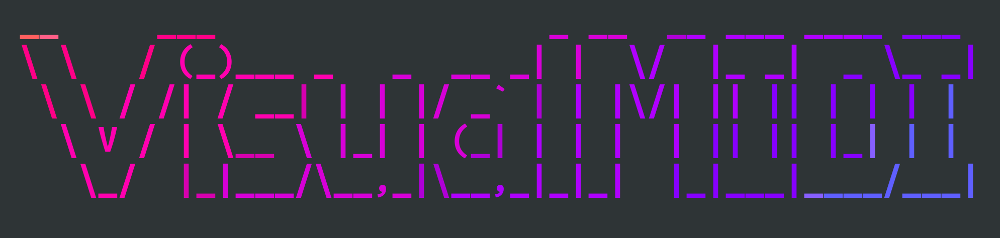
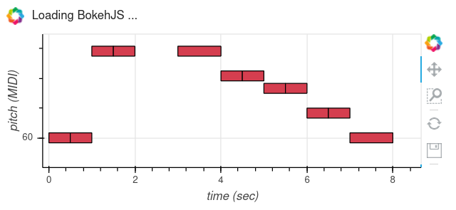
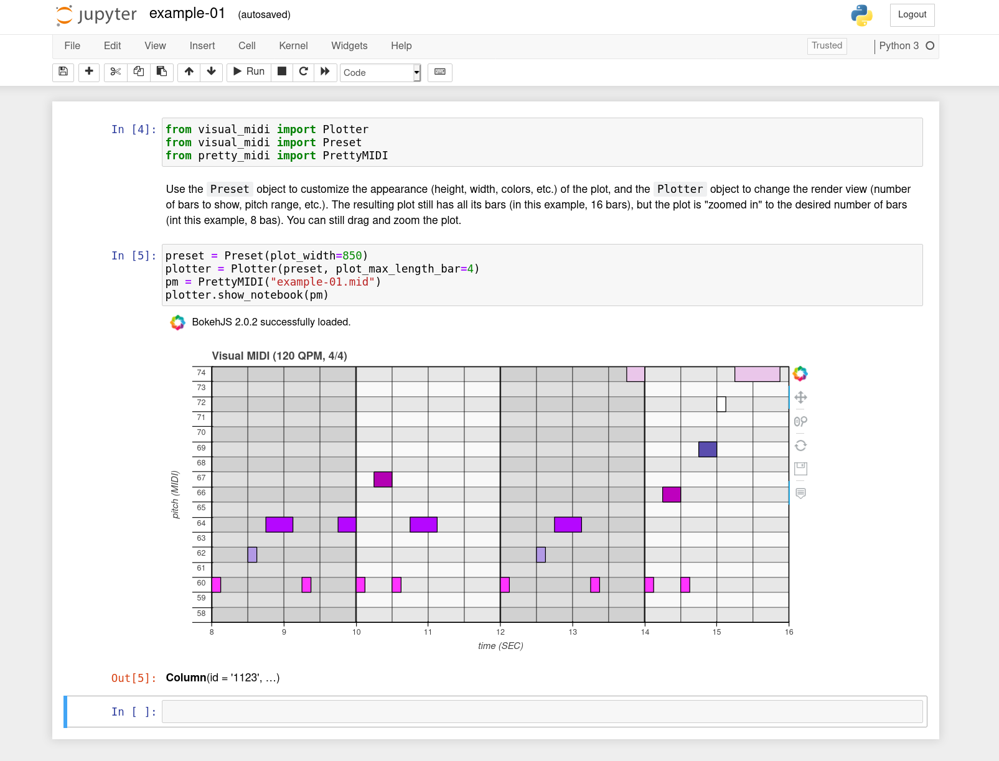

# Introducing Visual MIDI for pianoroll visualization

**2020/09/13**

When I was writing [Hands-On Music Generation with Magenta](https://www.packtpub.com/data/hands-on-music-generation-with-magenta) during 2019, I knew I would need to generate a lot of MIDI diagrams (often called **pianoroll** visualization for their similarities to their ancestor, the [physical piano roll](https://en.wikipedia.org/wiki/Piano_roll) for automated piano) like this one:


I've looked a some existing libraries to do that (such as [Pypianoroll](https://salu133445.github.io/pypianoroll/visualization.html) or the [`get_piano_roll`](https://github.com/craffel/pretty-midi/blob/78e33ab1c24e1156529320ea127dd51d57f7ab99/pretty_midi/instrument.py#L76) function in Pretty MIDI, but I needed more customization on appearance, size, colors, grid, etc. so I decided to write my own library, [Visual MIDI](https://github.com/dubreuia/visual_midi).

<p style="text-align:center">
  <a href="https://github.com/dubreuia/visual_midi" alt="Visual MIDI"></a>
</p>

## Introducing `NoteSequence`

When using Magenta, we use `NoteSequence`, an abstraction over a sequence of notes, that is used as an input / output of models for sequential data, such as DrumsRNN, MelodyRnn, MusicVAE, etc.  From Magenta 2.1.0 onwards, note sequences are outside of the Magenta package, in their own [note-seq](https://github.com/magenta/note-seq) library that you can install independently (`pip install note-seq`). Lets take a look at note sequences (this is taken from the [Hello Magenta Jupyter Notebook](https://colab.research.google.com/notebooks/magenta/hello_magenta/hello_magenta.ipynb)):

```python
from note_seq.protobuf import music_pb2

twinkle_twinkle = music_pb2.NoteSequence()

# Add the notes to the sequence.
twinkle_twinkle.notes.add(pitch=60, start_time=0.0, end_time=0.5, velocity=80)
twinkle_twinkle.notes.add(pitch=60, start_time=0.5, end_time=1.0, velocity=80)
twinkle_twinkle.notes.add(pitch=67, start_time=1.0, end_time=1.5, velocity=80)
twinkle_twinkle.notes.add(pitch=67, start_time=1.5, end_time=2.0, velocity=80)
twinkle_twinkle.notes.add(pitch=69, start_time=2.0, end_time=2.5, velocity=80)
twinkle_twinkle.notes.add(pitch=69, start_time=2.5, end_time=3.0, velocity=80)
twinkle_twinkle.notes.add(pitch=67, start_time=3.0, end_time=4.0, velocity=80)
twinkle_twinkle.notes.add(pitch=65, start_time=4.0, end_time=4.5, velocity=80)
twinkle_twinkle.notes.add(pitch=65, start_time=4.5, end_time=5.0, velocity=80)
twinkle_twinkle.notes.add(pitch=64, start_time=5.0, end_time=5.5, velocity=80)
twinkle_twinkle.notes.add(pitch=64, start_time=5.5, end_time=6.0, velocity=80)
twinkle_twinkle.notes.add(pitch=62, start_time=6.0, end_time=6.5, velocity=80)
twinkle_twinkle.notes.add(pitch=62, start_time=6.5, end_time=7.0, velocity=80)
twinkle_twinkle.notes.add(pitch=60, start_time=7.0, end_time=8.0, velocity=80) 
twinkle_twinkle.total_time = 8

twinkle_twinkle.tempos.add(qpm=60);

# This is a colab utility method that visualizes a NoteSequence.
note_seq.plot_sequence(twinkle_twinkle)
```

And you can see that the `plot_sequence` method generates a Bokeh plot:



This is included in the "note-seq" library. Visual MIDI is actually based on that rendering, but enables so much more in terms of customizations. But first, lets have a look at Pretty MIDI.

## Using Pretty MIDI

When we have a `NoteSequence`, either from defining it by hand or by getting it from the output of a model, we can transform them back and forth to another format called Pretty MIDI, which is a well-known library used to handle MIDI data in Python.

Let convert from `NoteSequence` to Pretty MIDI:

```python
from note_seq.midi_io import note_sequence_to_pretty_midi
pm = note_sequence_to_pretty_midi(note_seq)
```

And from Pretty MIDI to `NoteSequence`:

```python
from note_seq.midi_io import midi_to_note_sequence
note_seq = midi_to_note_sequence(pm)
```

We can also load the `NoteSequence` from a MIDI file (using Pretty MIDI):

```python
from note_seq.midi_io import midi_file_to_note_sequence
note_seq = midi_file_to_note_sequence('my_midi_file.mid')
```

## Using Visual MIDI to plot a pianoroll of Pretty MIDI

Great! Now we can plot our sequence as a piano roll using Visual MIDI:

```python
from pretty_midi import PrettyMIDI

plotter = Plotter()
plotter.show(pm, "/tmp/example-01.html")
```

Which will open the plot in a new browser window. If you prefer to show the plot in a Jupyter notebook:

```python
from visual_midi import Preset

preset = Preset(plot_width=850)
plotter = Plotter(preset, plot_max_length_bar=4)
pm = PrettyMIDI("docs/example-01.mid")
plotter.show_notebook(pm)
```



This also introduces the `Preset` object, which is used to customize the appearance of the plot. Refer to the [Visual MIDI documentation](https://github.com/dubreuia/visual_midi) for more information.

## Further developments

The Visual MIDI library is still in its infancy, if you have comments or requests, please add them to the [GitHub Issues](https://github.com/dubreuia/visual_midi/issues) page. Happy visualization!

