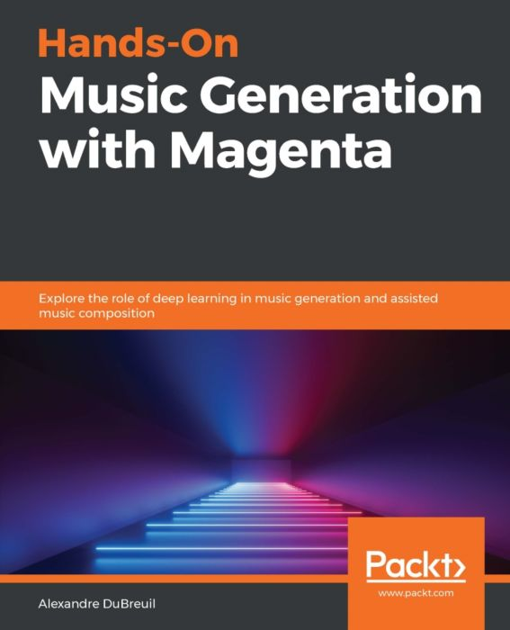

# Publications

## Books

### [Hands-On Music Generation with Magenta: Explore the role of deep learning in music generation and assisted music composition](2020-01-31-music-generation-with-magenta-deep-learning-in-music-generation)

 **2020/01/31** - Design and use machine learning models for music generation using Magenta and make them interact with existing music creation tools.

## Articles

### [Introducing Visual MIDI for pianoroll visualization](2020-09-13-introducing-visual-midi-for-pianoroll-visualization)

When I was writing [Hands-On Music Generation with Magenta](https://www.packtpub.com/data/hands-on-music-generation-with-magenta) during 2019, I knew I would need to generate a lot of MIDI diagrams (often called **pianoroll** visualization for their similarities to their ancestor, the [physical piano roll](https://en.wikipedia.org/wiki/Piano_roll) for automated piano). In need of customization on appearance, size, colors, grid, etc. so I decided to write my own library, [Visual MIDI](https://github.com/dubreuia/visual_midi).

### [Music Generation with Magenta 2.0.1: A migration guide from version 1.1.7](2020-06-06-music-generation-with-magenta-2-0-1-a-migration-guide-from-version-1-1-7)

**2020/06/06** - Writing a book about a software library like Google Magenta inhevitably ends by the code evolving while the book slowly becomes obsolete. Writing a second edition of the book, including the changes for that version, would be nice, but as we wait for that, let's look at how we update our code from Magenta 1.1.7 to Magenta 2.0.1.

### [Music Generation with Magenta: Using Machine Learning in Arts](2019-10-15-music-generation-with-magenta)

**2019/10/15** - Composing music is hard and the lack of inspiration can be daunting. A lot of elements are required to make it work: musical score, instruments, musicality, feeling, groove, originality. Music generation has been around for ages, even before the digital era, as a tool for musician to create new music and get inspired. What about machine learning? Can we use it as a tool for music generation? With Magenta, a music generation library based on Tensorflow, you can use the power of machine learning to help musical creation.

### [Deploying your application secrets: Hashicorp Vault and continuous delivery](2019-03-01-hashicorp-vault-and-continuous-delivery)

**2019/03/01** - Everybody has secrets: people, machines and web applications. Pretty much any application needs to access external or protected resources: databases, web services, secure tunnels, etc. Today we'll look into securing the resources that gives access to those external systems: application secrets.

### [Top 10 most mixed tracks of 2018](2018-12-31-top-10-mixed-tracks-2018)

**2018/12/31** - This year marks a turn in my DJ set since I stopped mixing techno altogether and decided to mix only tekno for a while (mainly tribal tekno). I discovered a lot of crazy tracks, rediscovering old releases from artist I know very well like Keja to new genres for me like Ely Muff from Kaotek.

### [Top 10 albums of 2018](2018-12-29-top-10-albums-2018)

**2018/12/29** - This year has been rich in discovery of new sounds. From the alien sounding latest Clark EP to downright creepy Herndon's Godmother, it has been a strange year in music production (and also in pretty much everything else).

### [dOOv revisits Bean Validation benchmark](2018-01-15-doov-revisits-bean-validation-benchmark)

**2018/01/15** - The dOOv library (Domain Object Oriented Validation) takes a different approach to domain model validation than popular validation libraries. It doesn’t implement the Bean Validation specification, but we thought it would be interesting to compare the performance of the different paradigms.

